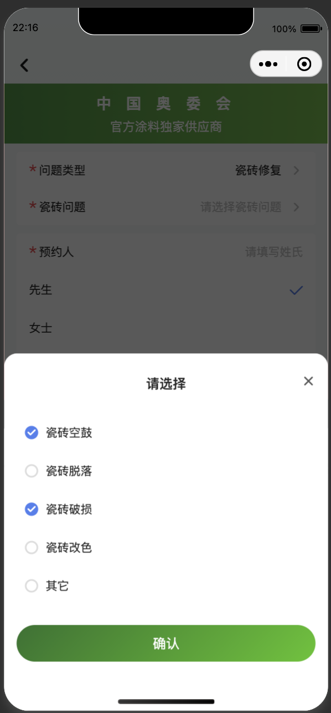
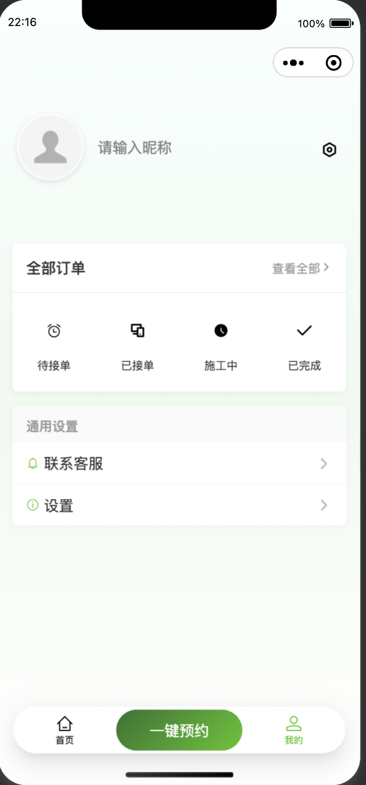
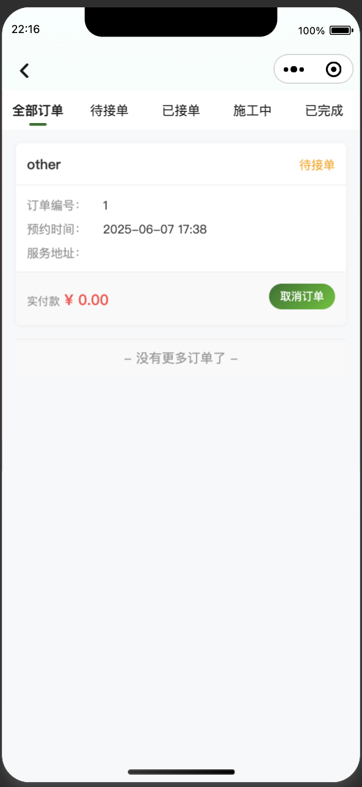
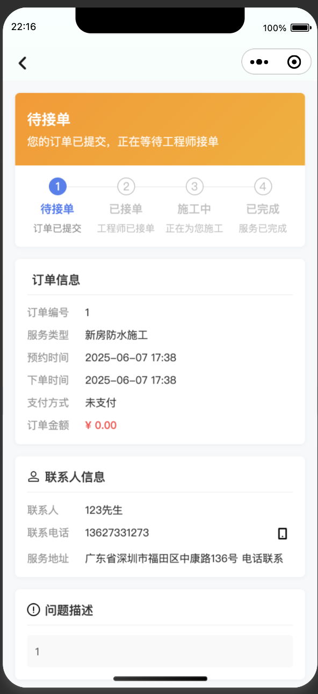
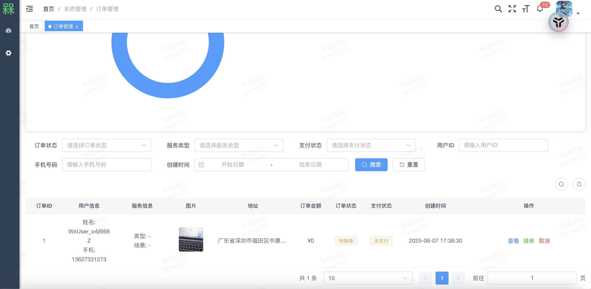
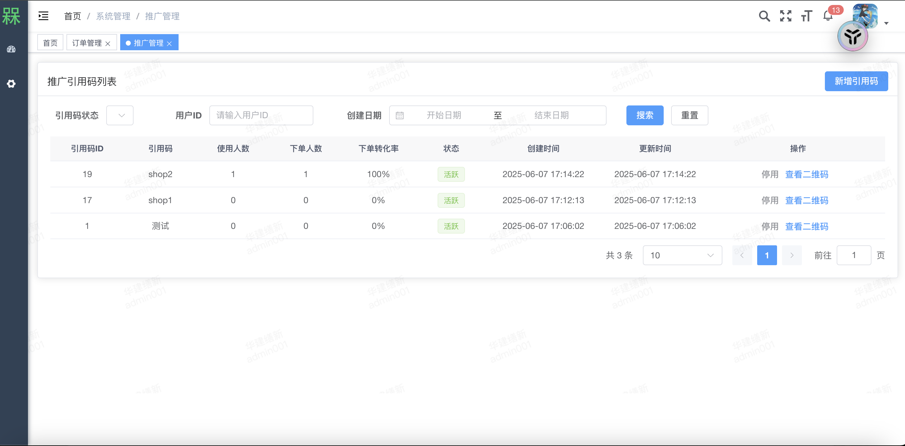
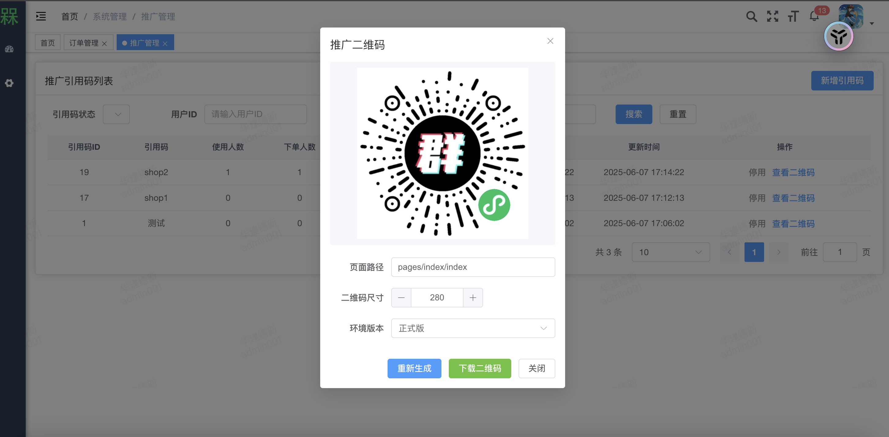

# 100-nest-project
In this project, I will build 100 applications with Nest as the backend, covering mini-programs/apps/web/mobile

## node 版本
v22.14.0

## 使用方式
大部分项目使用pnpm安装，有申明yarn.lock的项目需要使用 
``` typescript
yarn install 或者 pnpm install
```
## 技术栈
当前项目主要使用 nest + vue 构建了前后端，根据需求部分项目会使用 react 和 python
admin目录主要存放后台管理系统
server包含了后台管理的服务端，以及面向用户的服务端
application 则是应用端

## Docker 服务
项目包含以下 Docker 服务：
- **PostgreSQL 16**: 主数据库 (端口: 5432)
- **Redis 6.2**: 缓存服务 (端口: 6379)
- **Adminer**: 数据库管理工具 (端口: 8081)
- **n8n**: 工作流自动化平台 (端口: 5678)

### 启动服务
```bash
# 启动所有服务
docker-compose up -d

# 启动特定服务
docker-compose up -d n8n
```

### n8n 工作流平台
- 访问地址: http://localhost:5678
- 默认用户名: admin
- 默认密码: password
- 支持 PostgreSQL 数据持久化
- 集成 Redis 缓存

#### 活跃工作流
1. **获取新闻** - 自动采集AI新闻和外包工作信息
   - RSS源：新智元、腾讯科技、量子位、V2EX外包
   - 定时触发：每天7点和21点
   - AI智能整理并推送到飞书多维表格
   
2. **推送飞书本** - AI新闻助理
   - 从飞书多维表格获取最新AI新闻
   - 使用DeepSeek AI进行智能分析和推荐
   - 定时推送到飞书机器人（每天11点）
   
3. **群聊总结** - 微信聊天分析助手
   - 通过ChatLog SSE服务连接微信数据
   - 智能分析聊天记录生成结构化报告
   - 定时触发群聊总结（每天10点）

4. **V2EX外包工作信息收集** - 智能外包机会筛选系统
   - RSS源：V2EX外包板块 (https://www.v2ex.com/feed/outsourcing.xml)
   - 定时触发：每天9点自动获取最新工作机会
   - **📋 数据处理流程**：保持原始数据格式，价值评估作为附加信息
     - 原始数据：标题、内容、链接、分类、来源
     - 评估信息：值得关注、评估分数、评估理由、预算范围、技术栈等
   - **🎯 智能价值评估**：AI评估师根据7项标准筛选优质项目
     - ✅ 明确预算范围、主流技术栈、需求清晰、联系方式明确
     - ❌ 自动过滤低价、模糊需求、过时技术、非技术项目
   - **🔍 精准过滤**：只推送值得关注的高价值机会（worthy=true）
   - **📊 多维度存储**：飞书表格包含原始信息+AI评估结果

项目：
2.微信聊天洞察

### 2. 微信聊天洞察
<details>
<summary>点击查看项目截图</summary>

</details>

1.预约师傅上门服务

### 1. 预约师傅上门服务项目截图
<details>
<summary>点击查看项目截图</summary>










</details>

## 鸣谢
感谢开源者的分享精神

## 引用到的项目
[meimei-nestjs-admin](https://github.com/87789771/meimei-nestjs-admin)
[simple-orderManagementSystem](https://github.com/LORDyyyyy/simple-orderManagementSystem)
[uni-best](https://github.com/codercup/unibest)