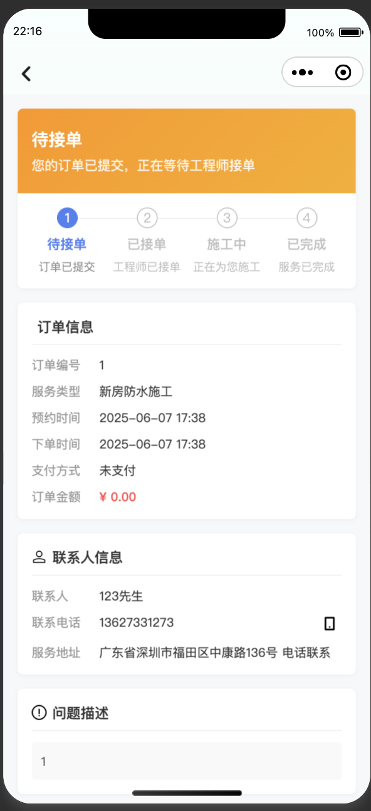

# 100-nest-project
In this project, I will build 100 applications with Nest as the backend, covering mini-programs/apps/web/mobile

## node 版本
v22.14.0

## 使用方式
大部分项目使用pnpm安装，有申明yarn.lock的项目需要使用 
``` typescript
yarn install 或者 pnpm install
```
## 技术栈
当前项目主要使用 nest + vue 构建了前后端，根据需求部分项目会使用 react 和 python
admin目录主要存放后台管理系统
server包含了后台管理的服务端，以及面向用户的服务端
application 则是应用端, 
项目：
1.预约师傅上门服务

### 1. 预约师傅上门服务项目截图
<details>
<summary>点击查看项目截图</summary>





</details>
### 2. 微信聊天记录总结
<details>


</details>


## 鸣谢
感谢开源者的分享精神

## 引用到的项目
[meimei-nestjs-admin](https://github.com/87789771/meimei-nestjs-admin)
[simple-orderManagementSystem](https://github.com/LORDyyyyy/simple-orderManagementSystem)
[uni-best](https://github.com/codercup/unibest)
[chat-log](https://github.com/sjzar/chatlog)