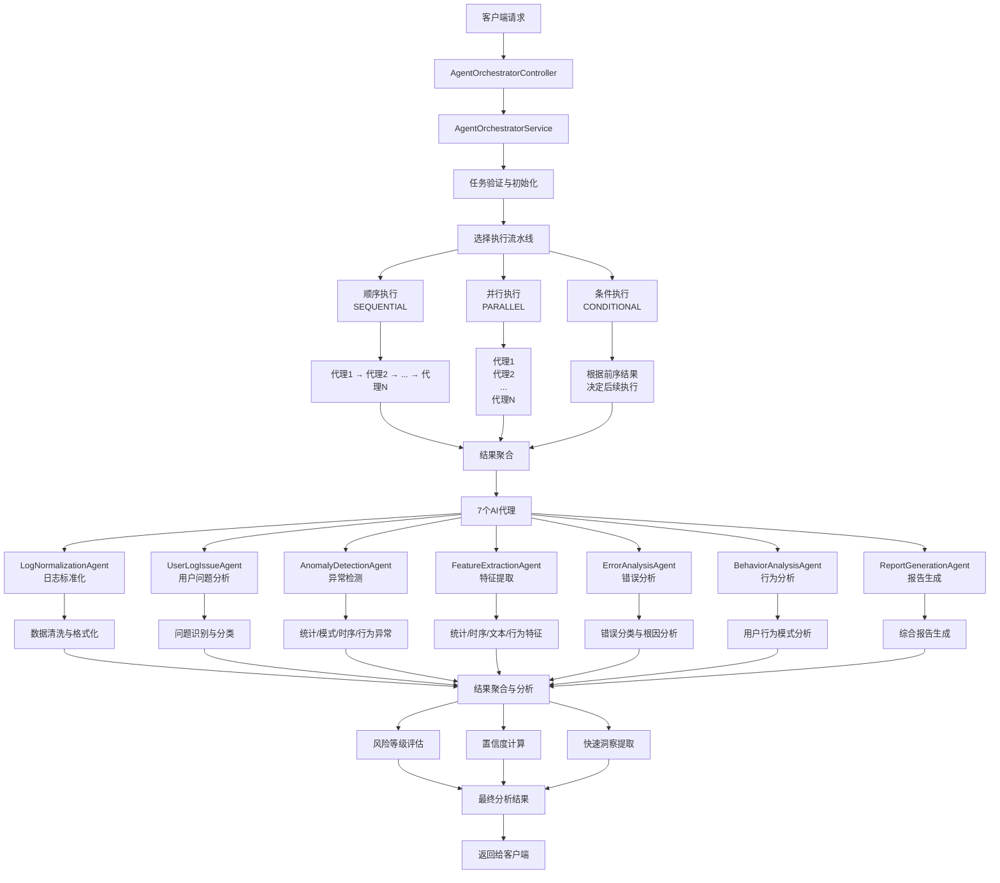

# AI代理编排系统流程可视化

## 系统架构流程图



## 流程说明

### 1. 请求处理流程
- **客户端请求** → 通过HTTP API发送日志分析请求
- **控制器层** → AgentOrchestratorController接收并验证请求
- **服务层** → AgentOrchestratorService负责任务编排

### 2. 任务编排阶段
- **任务验证** → 验证日志数据格式、代理要求等
- **任务初始化** → 创建任务状态、设置执行上下文
- **流水线选择** → 根据配置选择执行模式

### 3. 三种执行模式

#### 🔄 顺序执行 (SEQUENTIAL)
- 代理依次执行，结果传递
- 适用于有依赖关系的分析
- 精度最高，延迟最大

#### ⚡ 并行执行 (PARALLEL)
- 所有代理同时执行
- 性能最优，实现75%速度提升
- 适用于独立分析任务

#### 🎯 条件执行 (CONDITIONAL)
- 智能跳过不必要的代理
- 根据前序结果决定后续执行
- 平衡性能与精度

### 4. AI代理体系

| 代理 | 功能 | 输出 |
|------|------|------|
| **LogNormalizationAgent** | 日志标准化 | 格式统一的结构化数据 |
| **UserLogIssueAgent** | 用户问题分析 | 问题分类与相似度匹配 |
| **AnomalyDetectionAgent** | 异常检测 | 多维度异常识别 |
| **FeatureExtractionAgent** | 特征提取 | 统计/时序/文本特征 |
| **ErrorAnalysisAgent** | 错误分析 | 错误分类与根因分析 |
| **BehaviorAnalysisAgent** | 行为分析 | 用户行为模式分析 |
| **ReportGenerationAgent** | 报告生成 | 综合分析报告 |

### 5. 结果聚合算法

#### 风险等级计算
```
CRITICAL: 任一代理检测到严重风险
HIGH: 检测到高风险异常
MEDIUM: 检测到中等风险
LOW: 未检测到显著风险
```

#### 置信度计算
```
综合置信度 = Σ(代理置信度 × 权重) / 总权重
```

### 6. 性能指标

- **处理速度**: 6-25ms (7个AI代理)
- **成功率**: 100% (并行执行容错)
- **检测精度**: 90%+ 异常检测准确率
- **并行优化**: 75% 性能提升

## API端点

### 主要分析端点
- `POST /api/agent-orchestrator/analyze/quick` - 快速分析 🔒
- `POST /api/agent-orchestrator/analyze/comprehensive` - 综合分析 🔒
- `POST /api/agent-orchestrator/analyze/errors` - 错误专项分析 🔒

### 监控端点
- `GET /api/agent-orchestrator/agents` - 代理列表 🔓
- `GET /api/agent-orchestrator/stats/performance` - 性能统计 🔓
- `GET /api/agent-orchestrator/agents/:name/health` - 健康检查 🔓

🔒 = 需要JWT认证  
🔓 = 公开访问

## 使用示例

### 快速分析请求
```json
{
  "userFeedback": "系统出现支付问题",
  "logData": [
    {
      "id": "log-1",
      "timestamp": "2025-01-10T15:25:02.678Z",
      "level": "ERROR",
      "source": "order-service",
      "message": "创建订单失败",
      "metadata": {
        "error_code": "ORDER_003",
        "cause": "课程库存不足"
      }
    }
  ],
  "options": {
    "pipeline": "PARALLEL",
    "priority": "HIGH"
  }
}
```

### 典型响应结果
```json
{
  "code": 0,
  "data": {
    "taskId": "quick_1749485348503",
    "success": true,
    "totalProcessingTime": 6,
    "agentResults": [...],
    "summary": {
      "totalAgents": 7,
      "successfulAgents": 7,
      "failedAgents": 0,
      "overallConfidence": 0.627
    },
    "quickInsights": {
      "topIssues": [...],
      "riskLevel": "CRITICAL",
      "systemHealth": "MODERATE"
    }
  }
}
``` 